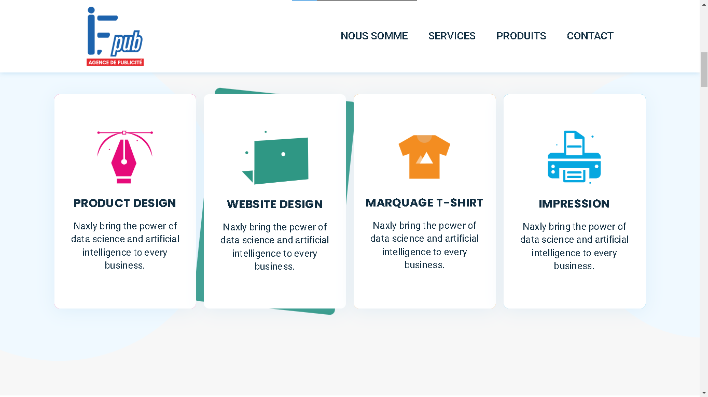
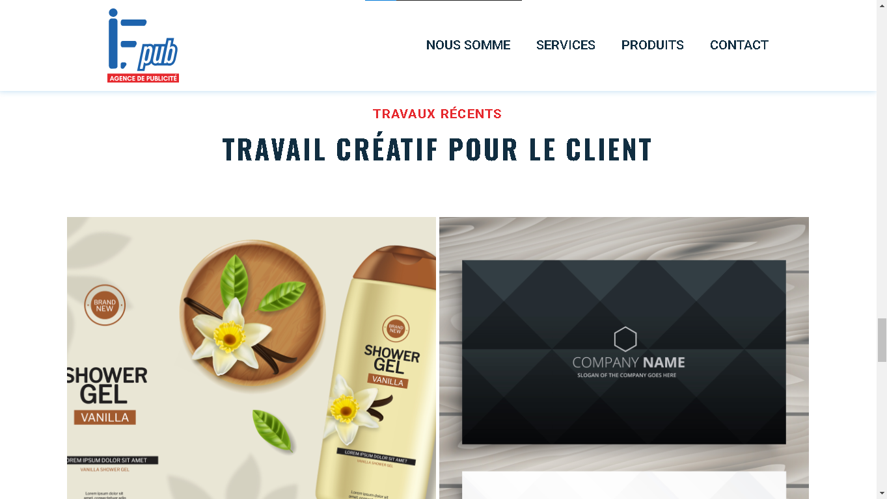
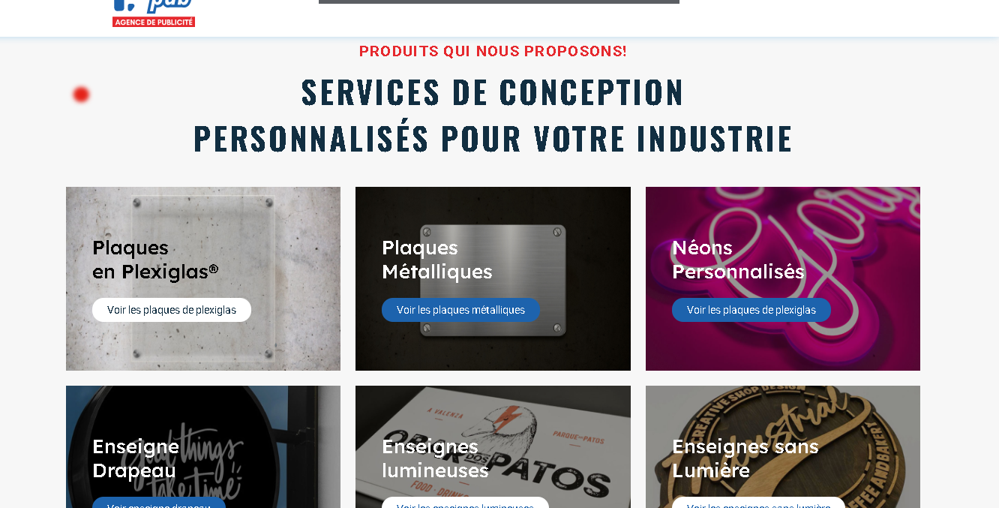

# If-PuB - Advertising Service Website


## 🌟 About If-PuB
If-PuB is a professional advertising service website designed to connect businesses with their target audience. Built using modern web technologies, If-PuB provides an intuitive and user-friendly platform for promoting products and services effectively.

## 🚀 Features
- **Responsive Design:** Fully optimized for desktop and mobile devices.
- **Dynamic Advertisements:** Showcase ads with engaging animations and interactive elements.
- **User-Friendly Interface:** Simple and sleek UI for seamless navigation.
- **Secure and Fast:** Optimized for performance and security.
- **SEO-Friendly:** Structured content for better search engine visibility.

## 🔧 Technologies Used
- **HTML5** - For structuring the website.
- **CSS3** - For styling and layout.
- **JavaScript** - For interactivity and dynamic features.

## 📸 Screenshots
### Homepage


### Advertisements Section

### Advertisements Section


## 📂 Installation & Setup
1. Clone the repository:
   ```sh
   git clone https://github.com/yourusername/if-pub.git
   ```
2. Navigate to the project directory:
   ```sh
   cd if-pub
   ```
3. Open `index.html` in a browser:
   ```sh
   open index.html
   ```

## 🌍 Live Demo
Check out the live version here: [If-PuB Live](https://lechehebdjaafar.github.io/IF-PuB/)

## 📬 Contact
For any inquiries, feel free to reach out:
- **Linkdin:** [Lecheheb Djaafar](https://www.linkedin.com/in/lecheheb-djaafar-226594348/)
- **Instagram:** [@ddos_attack_co](https://www.instagram.com/ddos_attack_co)

---
⚡ *Developed with passion by Lecheheb Djaafar.*

